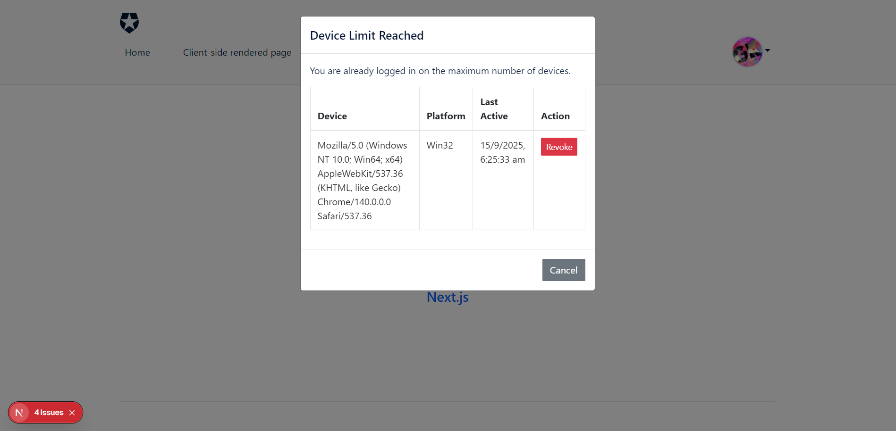

# Project Name

**Next.js Auth0 Device & Session Management**

A Next.js project integrating **Auth0 authentication** with **device registration and session management**. The app ensures that each user can only log in from a limited number of devices and handles session verification automatically.

---

## Screenshots

 

---

## Features

- **Auth0 Authentication**  
  Secure login and user management using Auth0.

- **Device Registration**  
  Each device gets a unique `device_id` stored in `localStorage` and registered with the backend API.

- **Session Management**  
  - Detects multiple active devices per user.  
  - Shows a modal if the user exceeds device limit.  
  - Allows revoking old devices directly from the modal.  

- **Sequential Flow**  
  Device registration occurs **before** session verification to ensure consistent session handling.

- **Bootstrap & Reactstrap UI**  
  Responsive design using Bootstrap 4 and Reactstrap components.

---

## Technologies

- Next.js 14  
- React 18  
- Auth0 (nextjs-auth0)  
- Reactstrap + Bootstrap 4  
- Context API for state management  

